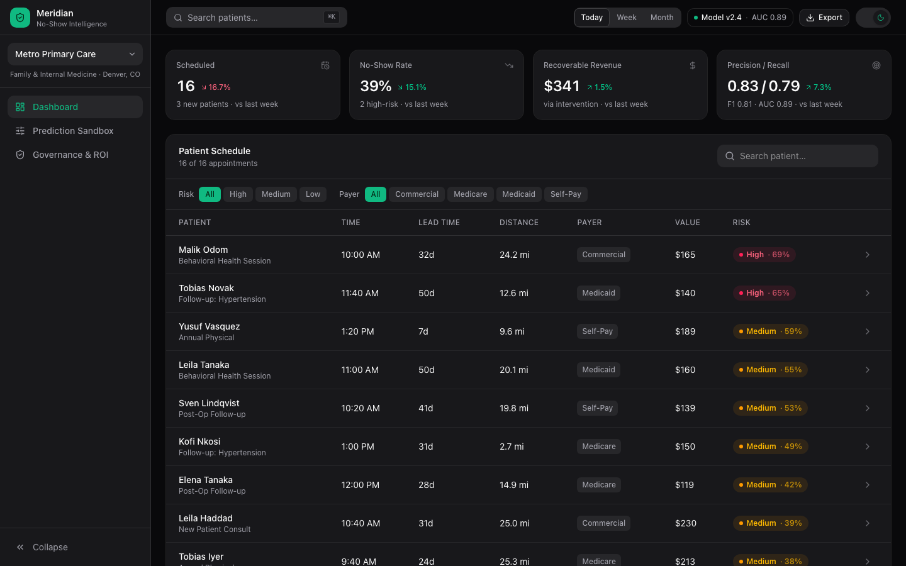
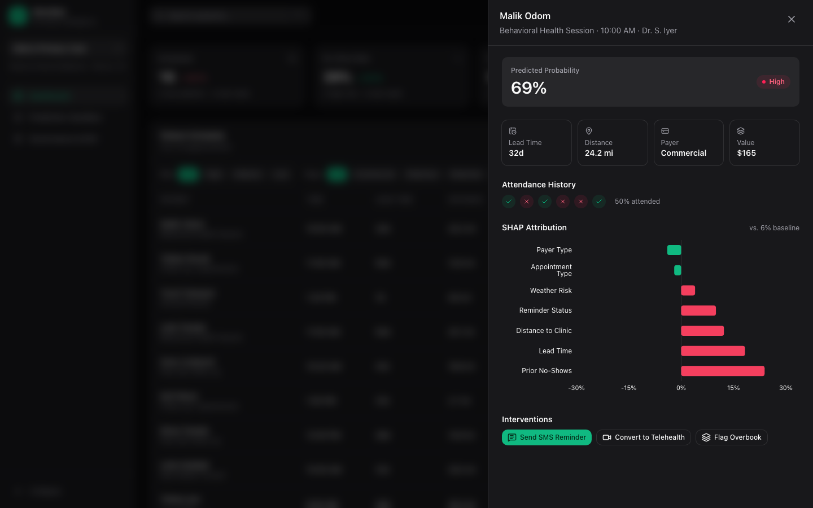
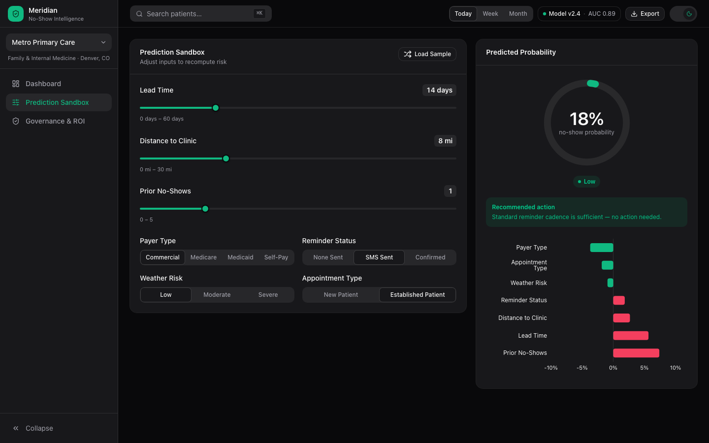
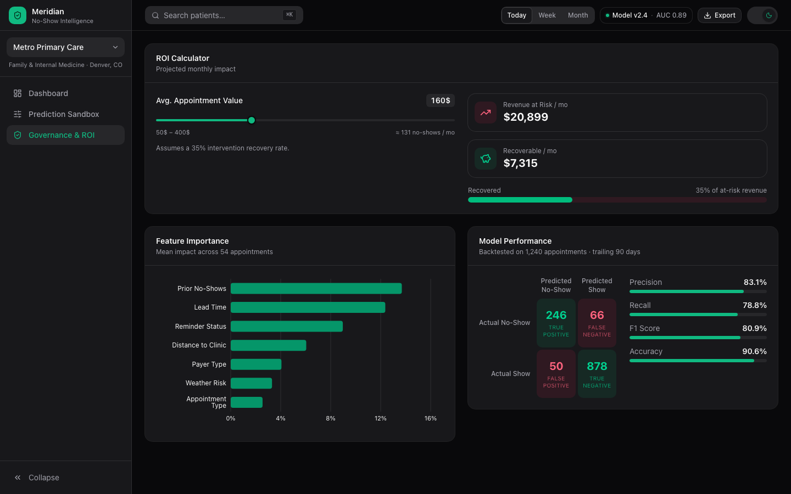

<div align="center">

# Meridian

**Explainable no-show risk intelligence for independent healthcare practices**

[](https://react.dev)
[](https://www.typescriptlang.org)
[](https://vitejs.dev)
[](https://tailwindcss.com)

</div>



## What it does

Meridian turns a clinic's appointment schedule into a ranked, explainable risk view. Every patient gets a no-show probability, a plain-language breakdown of exactly which factors drove that score, and one-click actions (SMS reminder, telehealth conversion, overbook flag) that recompute the score live. A financial impact calculator and model-performance panel translate the model into numbers a clinic operator or finance lead can act on.

It is a fully client-side application. There is no backend, no database, and no API — the dataset is generated deterministically in the browser, and the scoring engine runs entirely on the client. Clone it, install, and run.

## Highlights

- **Explainable scoring, not a black box.** Every prediction ships with a SHAP-style attribution chart showing which factors pushed risk up or down, and by how much.
- **Actionable, not just informational.** Interventions in the patient panel change the underlying features and recompute the score in the same view.
- **Built for the whole team.** A prediction sandbox for testing scenarios, and a governance panel with model precision/recall, a confusion matrix, and an ROI calculator for leadership.
- **Command palette.** `⌘K` / `Ctrl+K` jumps to any page or searches patients directly.
- **Responsive by design.** A persistent collapsible sidebar on desktop becomes a slide-in drawer on mobile; every table, chart, and panel is verified down to 320px.
- **Light and dark themes**, with the preference persisted locally.

## Screens

| Dashboard | Patient detail |
|---|---|
|  |  |

| Prediction sandbox | Governance & ROI |
|---|---|
|  |  |

## Quick start

```bash
npm install
npm run dev
```

Open `http://localhost:5173`. See [docs/GETTING_STARTED.md](docs/GETTING_STARTED.md) for build, preview, and deployment steps.

## Documentation

| Document | Covers |
|---|---|
| [docs/GETTING_STARTED.md](docs/GETTING_STARTED.md) | Installing, running, building, and deploying |
| [docs/FEATURES.md](docs/FEATURES.md) | What each screen does and how to read every number on it |
| [docs/ARCHITECTURE.md](docs/ARCHITECTURE.md) | System design, folder structure, and the risk-scoring engine |
| [docs/DESIGN_SYSTEM.md](docs/DESIGN_SYSTEM.md) | Color tokens, typography, spacing, and component patterns |
| [docs/USER_FLOWS.md](docs/USER_FLOWS.md) | Primary user journeys through the app, with flow diagrams |

## Tech stack

| Layer | Choice |
|---|---|
| Framework | React 19, TypeScript, Vite |
| Styling | Tailwind CSS v4, CSS-first token configuration |
| Animation | Framer Motion |
| Charts | Recharts |
| Icons | lucide-react |
| State | Local component state and a single toast context — no external state library |

## Project status

All data is synthetically generated for demonstration. The scoring engine, dataset generator, and UI are complete and functional; there is no backend to connect because none is required for the product to be evaluated end to end.

---

Built by [Chanasak Choonuch](https://github.com/chanasakch).
