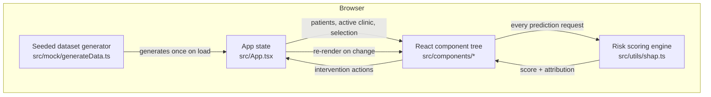

# Architecture

## Overview

Meridian is a single-page React application with no server component. Every piece of data — the patient schedule, risk scores, feature attributions, and model metrics — is generated or computed in the browser. This is a deliberate simplification for a demonstration product: it keeps the entire system inspectable in the client and removes any infrastructure dependency for evaluating it.



## Folder structure

```
src/
├── types/            Domain types shared across the app
├── utils/
│   ├── shap.ts         The scoring engine — see below
│   └── format.ts        Currency, percent, and trend formatting
├── mock/
│   └── generateData.ts  Seeded synthetic dataset (4 clinics, ~54 patients)
├── hooks/
│   ├── useTheme.ts       Dark/light mode, persisted to localStorage
│   └── useToast.tsx      Toast notification context and provider
├── components/
│   ├── ui/                Primitives: Button, Card, Badge, Slider, SegmentedControl, Sheet, Tooltip, ToastViewport
│   ├── layout/
│   │   ├── Sidebar.tsx      Desktop navigation, collapsible
│   │   ├── MobileSidebar.tsx Mobile navigation drawer
│   │   ├── Header.tsx        Top bar: search trigger, date range, export, theme
│   │   ├── CommandPalette.tsx ⌘K search across pages and patients
│   │   └── nav-items.ts       Shared navigation configuration
│   ├── dashboard/           KPI cards, patient schedule table, explainability panel, attribution chart
│   ├── sandbox/              Prediction sandbox
│   └── insights/              Feature importance, confusion matrix, ROI calculator
└── App.tsx                    Top-level state and layout composition
```

## The scoring engine

The architectural core of the application is a single pure function in `src/utils/shap.ts`:

```ts
computeRiskBreakdown(features: PredictionFeatures): RiskBreakdown
```

It accepts seven interpretable features — lead time, distance, prior no-shows, payer type, reminder status, weather risk, and appointment type — and returns both a final probability and a fully attributed breakdown of how each feature contributed to it, in the same shape a real SHAP explainer would return for a trained model.

Every consumer of a prediction calls this same function: the patient schedule, the explainability panel, the prediction sandbox, and the feature-importance aggregation on the governance page. There is exactly one scoring implementation, so a sandbox prediction and a real schedule row can never disagree with each other by construction.

This also defines the integration seam for a real model. Replacing the synthetic scoring logic inside `computeRiskBreakdown` with a call to a trained model's inference endpoint (for example, a FastAPI service serving a gradient-boosted model with a SHAP explainer) requires no change anywhere else in the application, because every consumer already speaks in terms of `RiskBreakdown` and `FeatureContribution[]`.

## Dataset generation

`src/mock/generateData.ts` produces a deterministic synthetic dataset using a seeded PRNG (`mulberry32`), so the same patients, appointments, and derived scores appear on every load and every deploy. This matters for a demo product: the numbers shown in a walkthrough or screenshot stay stable rather than reshuffling on refresh.

## State management

Application state lives in `src/App.tsx` as local React state: the patient list, the active clinic, the active tab, the selected patient, and UI flags for the mobile drawer and command palette. There is no external state management library. At this data scale — a handful of clinics and roughly fifty patients — prop drilling through two or three component levels is simpler to reason about than introducing a store, and every state transition is a plain `useState` setter.

The one exception is toast notifications, which use a small React context (`src/hooks/useToast.tsx`) since toasts are triggered from deeply nested components (intervention buttons inside the patient panel) and consumed by a single component mounted at the root (`ToastViewport`).

## Rendering and interaction

- **Framer Motion** drives every enter/exit transition: the sidebar drawer and patient panel slide in from their respective edges, toasts fade and scale, and the segmented-control and tab indicators animate between positions using shared layout IDs rather than manual position calculation.
- **Recharts** renders the SHAP attribution chart, the feature-importance bar chart, and the sandbox's radial probability gauge. The attribution chart uses a custom bar shape to correctly render bars that extend in either direction from a zero baseline, since SVG does not support negative-width rectangles natively.
- **Tailwind CSS v4** is configured entirely in `src/index.css` using CSS-first configuration — there is no separate JavaScript config file. Design tokens are CSS custom properties, redefined once for light mode and once for dark mode, and consumed as Tailwind utilities through a `@theme inline` mapping. See [DESIGN_SYSTEM.md](DESIGN_SYSTEM.md) for the token reference.

## Type safety

The project compiles under TypeScript's strict mode with `noUnusedLocals`, `noUnusedParameters`, and `verbatimModuleSyntax` enabled. Domain types (`Patient`, `Clinic`, `PredictionFeatures`, `RiskBreakdown`, `FeatureContribution`) are defined once in `src/types/index.ts` and flow through every layer without re-declaration.
