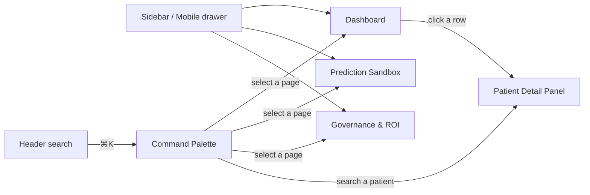
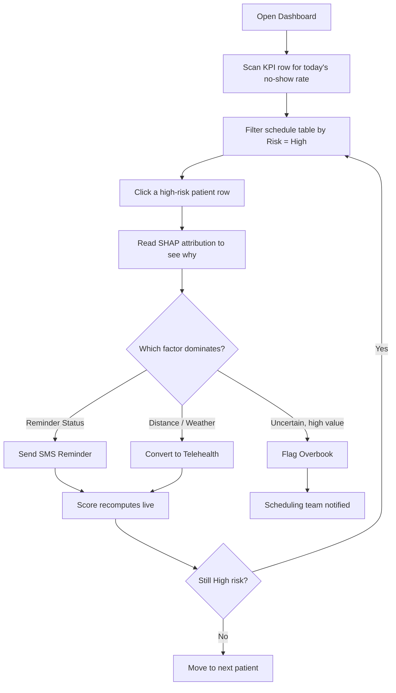
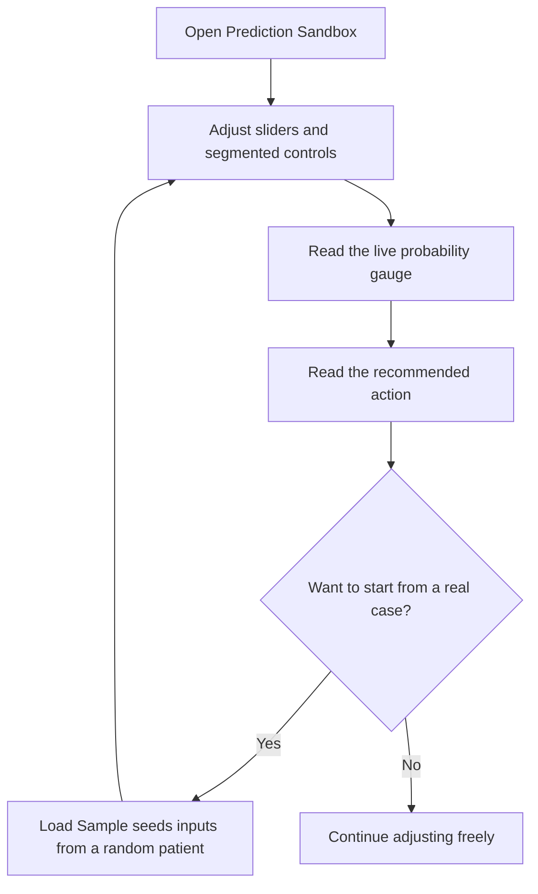
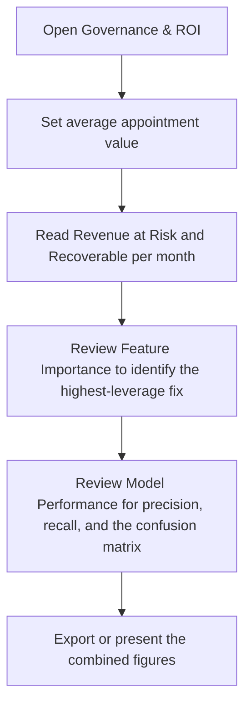

# User Flows

## Navigation structure

Three destinations are reachable from every entry point: the sidebar (persistent on desktop, a drawer on mobile) and the command palette (`⌘K`, reachable from anywhere). The patient detail panel is not a page — it is a global overlay that can open from the dashboard table or directly from a command palette search result, without first navigating to the dashboard.

## Flow 1 — Triaging today's schedule

The core operational loop: a clinic staff member reviews the day's appointments, identifies which ones are at risk, and acts on the highest-priority cases.

The loop is designed to close without leaving the panel: the same view that explains the risk also contains the actions that reduce it, and the score updates immediately so the effect of an action is visible before moving to the next patient.

## Flow 2 — Testing a scenario before it happens

Used to answer "what if" questions that are not tied to a real, currently-scheduled patient — training a new staff member, or sanity-checking a policy change.

The sandbox uses the identical scoring function as the live schedule, so a sandbox result and a real patient's score are directly comparable.

## Flow 3 — Building a financial case for leadership

Used by a clinic manager or finance stakeholder to translate model output into a monthly dollar figure and to establish trust in the model itself before presenting it upward.

Feature importance and model performance are deliberately placed on the same page as the ROI calculator: a financial projection is only as credible as the model behind it, so the evidence for that model sits next to the number it justifies.

## Responsive behavior

Every flow above is unchanged in substance across breakpoints; only the composition changes:

| Breakpoint | Navigation | Schedule table | Panels |
|---|---|---|---|
| Desktop (≥ 1024px) | Persistent sidebar, collapsible | Full table | Patient panel and command palette as centered/anchored overlays |
| Tablet (640–1023px) | Persistent sidebar | Full table, horizontally scrollable if needed | Same overlays, full-width panel |
| Mobile (< 640px) | Slide-in drawer from a header hamburger | Full table, horizontally scrollable, filter chips wrap | Full-width panel and palette |
